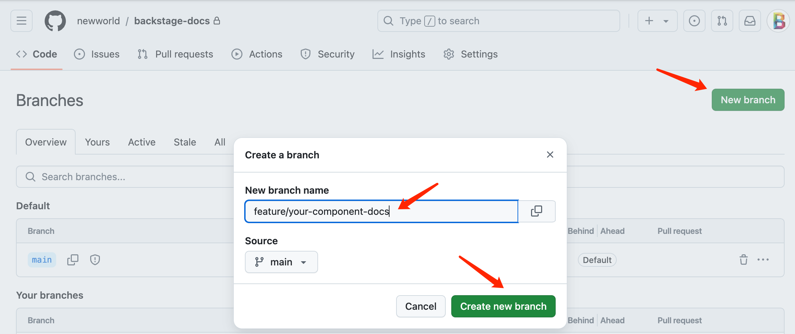
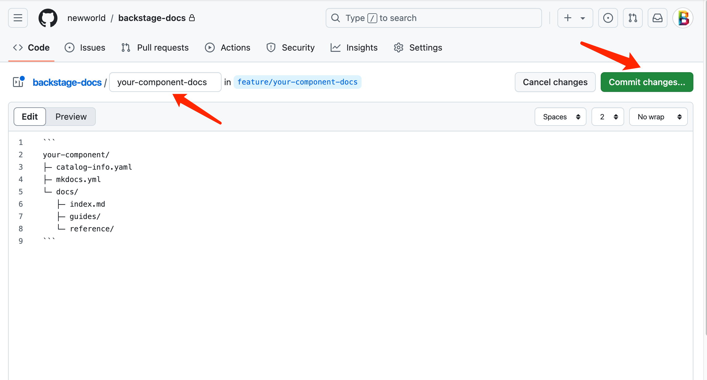
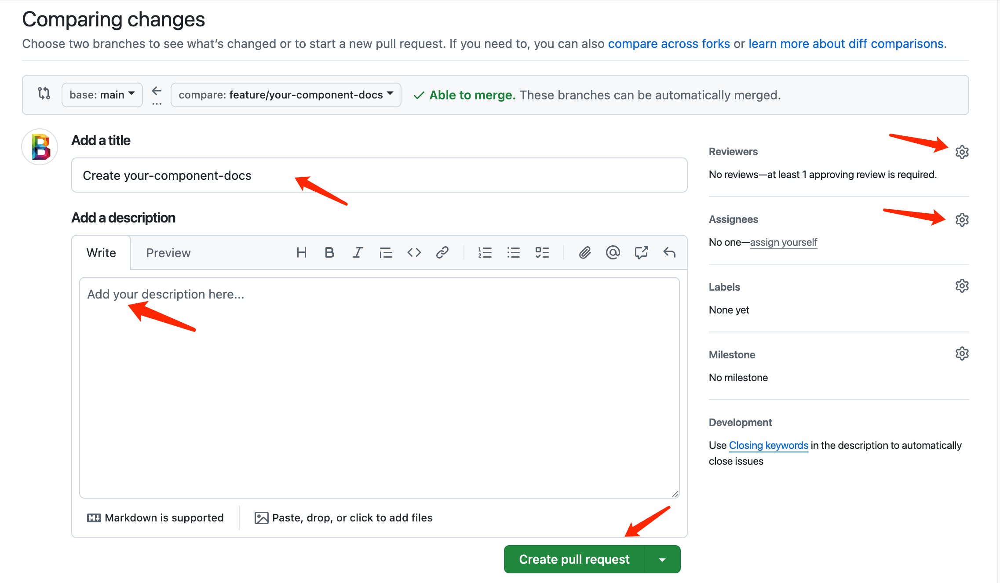
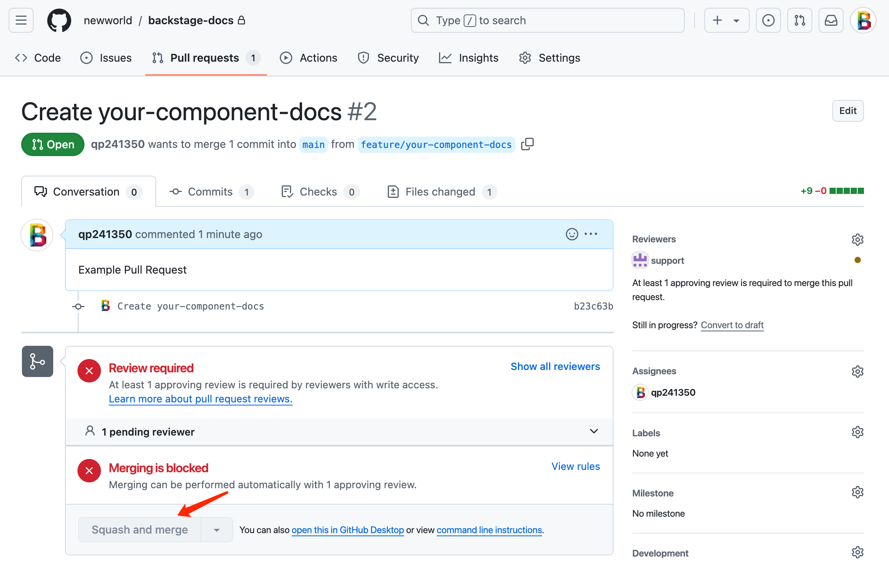
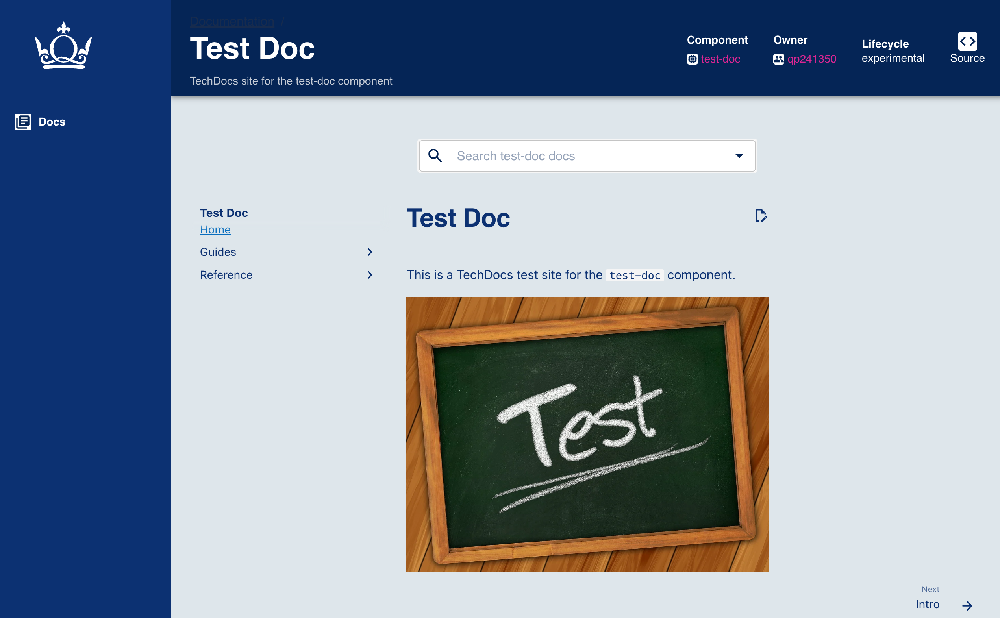

# PR Workflow for TechDocs (Central Repo)

Follow this workflow to contribute TechDocs for your component.

## 1) Create your component folder

- In the central repo: https://github.qmul.ac.uk/newworld/backstage-docs
- Create a feature branch, e.g. `feature/your-component-docs`.
- Add your folder structure:

<div style="width:70%; margin: 0 auto;">

```text
your-component/
├─ catalog-info.yaml
├─ mkdocs.yml
└─ docs/
   ├─ index.md
   ├─ guides/
   └─ reference/
```

</div>
{ style="display:block; margin:0 auto; width:70%" }

## 2) Commit and push your branch

- Commit your docs and push the branch to the remote.

{ style="display:block; margin:0 auto; width:70%" }

## 3) Open a Pull Request to main

- Open a PR to merge into `main`.
- Backstage only discovers entities from `main` in this repo.

{ style="display:block; margin:0 auto; width:70%" }

## 4) Review and merge

- Request review from your team.
- Once approved, merge the PR into `main`.

{ style="display:block; margin:0 auto; width:70%" }

## 5) View docs in Backstage

- Go to https://unified.a.comp-teach.qmul.ac.uk/
- Login with your Queen Mary (QMUL) account.
- Find your component and open the Docs tab.

{ style="display:block; margin:0 auto; width:70%" }

## Notes

- Edit links: ensure `repo_url` and `edit_uri` are set in your `mkdocs.yml` to this repo and your component path.
